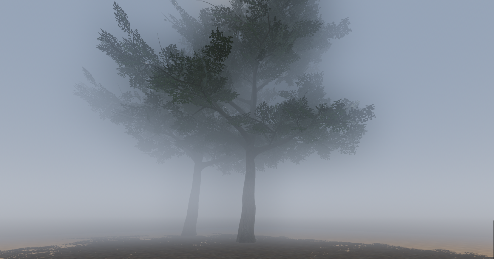

# Godot Fog Scattering

Compositor Effect for fog scattering.

Only for Forward+ renderer.

## To do
- Smooth radius adjustment (fading of last blur layer?)
- Environment fog sync (how to get environment values in compositor effect?)
- Fix objects in front contributing to blur texture (can it be done cheaply?)

## Credits
[Godot Dual Kawase Blur](https://github.com/Ultipuk/godot-dual-kawase-blur/tree/main)